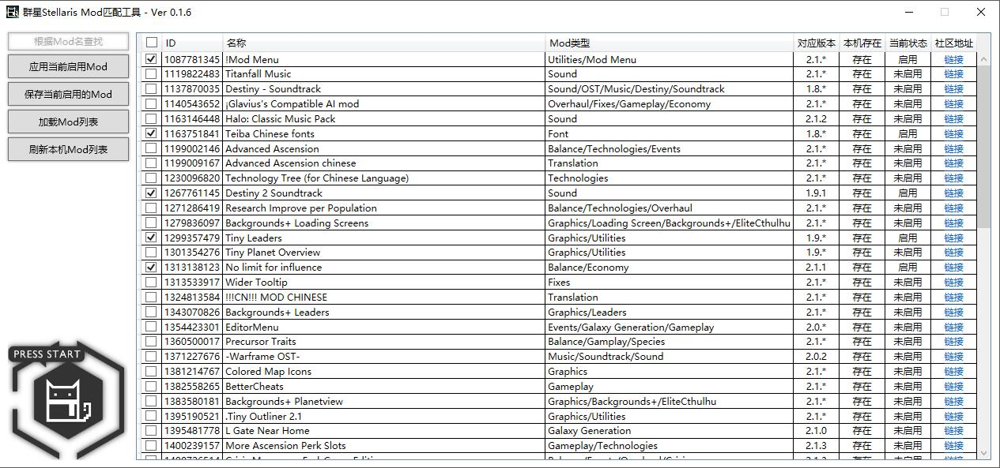
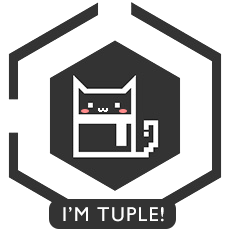

# StellarisModMatch
## 群星mod匹配工具

能够加载并检查群星stellaris的mod情况生成列表，在界面选择想要启用的mod或将mod列表生成文件保存，适用于玩家参加不同成员不同mod的联机情况。

初衷：为了避免让在玩家们同步mod过程中，大幅减少联机兴趣导致的一拍两散...   

>e.g.    
  T： （中立邪恶）  我今天发现了个不错的mod，可以一试！ xD      
M：（混乱中立）    不加不加，每次都要对mod不麻烦吗 :(  
糕：（混乱邪恶）没错没错！ :P  
T： 我日，我加不进来，你们谁把mod截个图发我看看。=(   
M：还得退出来... :(  
糕：就是就是！:P  
（Two minutes late...）  
T：（满头大汉）不行啊，mod还是不对，我落下什么了... :o  
M：emmmmm那下次再玩吧。=|  
糕：好的好的！:P  
T：....

初版大概仅写了5天时间（利用摸鱼时间...），当然只是为了实现功能编码水平从各种意义上也很摸。  
快写完的时候发现这类工具其实是有的（强调：但是界面真的好丑！）  
于是在给朋友（上面的M和糕2333）测试过后肝掉了bug和功能上的缺失。   
如果想要 **提交bug** / **背刺本人** / **检举摸鱼** ，请将情况和截图发送至：chunhaqiushif@hotmail.com  

兴趣驱动，后续更新得看各位反馈给我的信息、问题的严重性和时间情况...  
最后祝~~菌菇粑粑~~时之虫爱着各位！xD

下载链接：https://github.com/chunhaqiushif/StellarisModMatchTool/blob/master/StellarisModMatch/bin/Debug/StellarisModMatchTool.exe

---
## 更新日志

1. 2018.10.8  
Beta版本 v0.1.6 发布

2. 2018.10.9  
修正了首次加载不能全选的丢人bug  
修正了点击“加载mod”按钮后取消会取消所有mod的选择  
修改了按钮的描述  
更改了刷新按钮的功能为“恢复初始启用状态”  
---